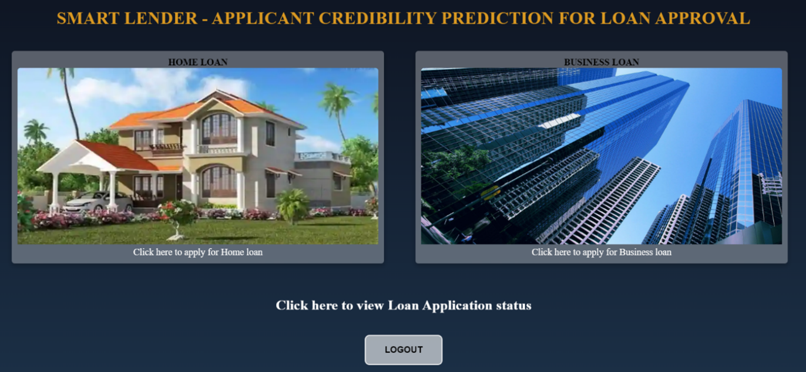

# IBM-Project-2070-1658425806

## Smart Lender - Applicant Credibility Prediction for Loan Approval
<br>

### Setup & Installation
<br>

### 1 .Clone the git repo
          
```
git clone https://github.com/IBM-EPBL/IBM-Project-2070-1658425806.git
cd Project Development Phase/Sprint 4
```

### 2. Add configuration information and API_KEY in config file

<br>

### 3. Create virtual environment and install the requirements

```
py -3 -m venv venv
venv\Scripts\activate
pip install -r requirements.txt
```

### 4. Create/Migrate a database

```
python manage.py
```

### 5. Run the application

```
set FLASK_APP='routes.py'
flask run
```
OR
```
python routes.py
```

### OUTPUT
<br>




